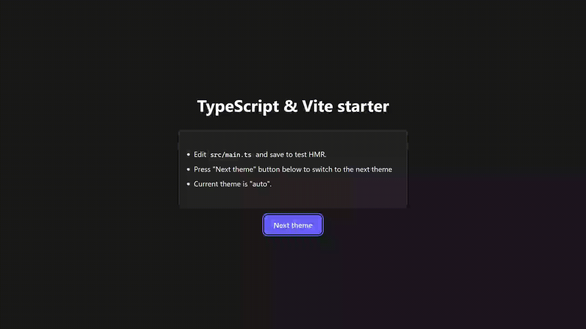

# TypeScript & Vite starter template

A modern, production-ready TypeScript & Vite starter template with comprehensive tooling for front-end development.



## Features

- **Vite** - build tool with HMR.
- **TypeScript** - strict type checking with modern ES features.
- **Vitest** - unit testing with coverage reports.
- **SCSS** - modern CSS with variables, mixins and a functioning theming system.
- **ESLint + Prettier** - code formatting and linting.
- **Husky & lint-staged** - pre-commit hooks.
- **VS Code** - optimized workspace settings.
- **Path aliases** - clean import statements with `@/` prefix.

## Quick start

1. **Install dependencies**

   ```bash
   npm install
   ```

2. **Start development server**

   ```bash
   npm run dev
   ```

3. **Open browser** - Vite will automatically open http://localhost:3000.

## Scripts

| Command                 | Description                             |
| ----------------------- | --------------------------------------- |
| `npm run dev`           | Start development server with HMR.      |
| `npm run build`         | Build for production.                   |
| `npm run preview`       | Preview production build locally.       |
| `npm run test`          | Run tests once.                         |
| `npm run test:watch`    | Run tests in watch mode.                |
| `npm run test:ui`       | Open Vitest UI for interactive testing. |
| `npm run test:coverage` | Generate test coverage report.          |
| `npm run lint`          | Check code with ESLint.                 |
| `npm run lint:fix`      | Fix ESLint issues automatically.        |
| `npm run format`        | Format code with Prettier.              |
| `npm run type-check`    | Check TypeScript types.                 |
| `npm run ci`            | Run all checks (CI pipeline).           |

## Project structure

```
src/
├── main.ts              # Application entry point.
├── utils/
│   └── app.ts           # Application setup utilities.
├── styles/
│   └── _variables.scss  # SCSS variables and design tokens.
└── types/
    └── assets.d.ts      # Type definitions for assets.
styles/
├── main.scss            # Global styles.
└── _reset.scss          # CSS reset.
tests/
├── app.test.ts          # Example test file.
└── setup.ts             # Test environment setup.
```

## Development guidelines

### Code style

- Use **TypeScript strict mode** with additional safety checks.
- **ESLint + Prettier** enforced via pre-commit hooks.
- **Path aliases** for clean imports: `@/utils/app` instead of `../utils/app`.
- **SCSS variables** defined in `src/styles/_variables.scss`.

### Testing

- **Vitest** with jsdom environment for DOM testing.
- **Coverage reporting** with v8 provider.
- Tests located in `tests/` directory.

### VS Code integration

- Recommended extensions auto-suggested.
- Format on save enabled.
- ESLint auto-fix on save.
- TypeScript import suggestions optimized.

## Production considerations

- **Build optimization** with automatic code splitting.
- **TypeScript compilation** before Vite bundling.
- **Source maps** enabled for debugging.
- **Modern target** (ESNext) for optimal bundle size.
- **Asset type definitions** for static imports.

## Extending the template

### Adding UI libraries

```bash
npm install some-ui-library
npm install -D @types/some-ui-library
```

### Adding CSS frameworks

```bash
npm install -D tailwindcss postcss autoprefixer
npx tailwindcss init -p
```

### Adding state management

```bash
npm install zustand
```
